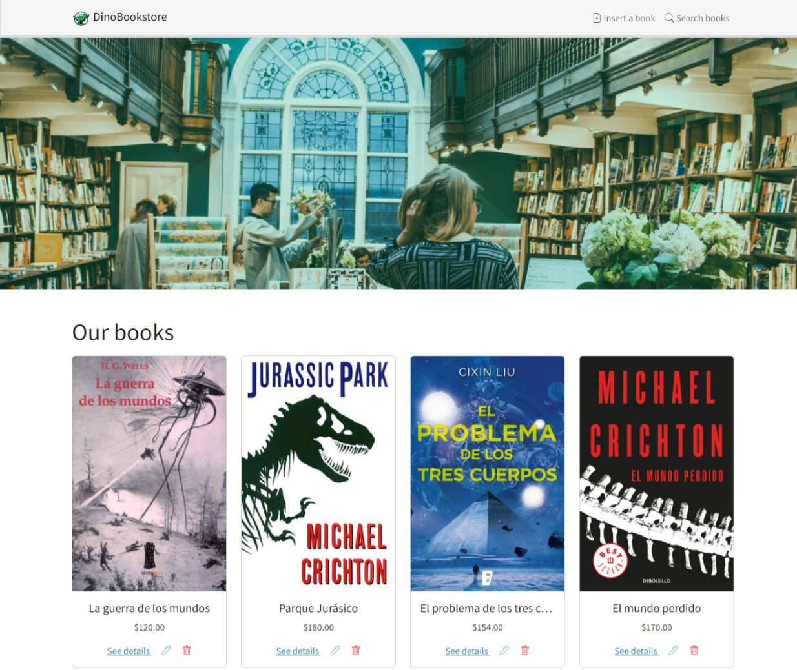

# DinoBookstore 🦖📚

Sistema web de una tienda de libros hecha con PHP 8, MySQL, Bootstrap, JQuery y MVC.

# Características
* Listado de libros
* Lectura de un libro por ISBN
* Registro de libros
* Actualización de libros
* Eliminación lógica de libros
* Filtrado de libros con AJAX
* Subir portadas para los libros

# Instalación
1. Crear la base de datos (`sql/database.sql`)
2. Crear la tabla (`sql/tables.sql`)
3. Poblar la tabla (`sql/initial-data.sql`)